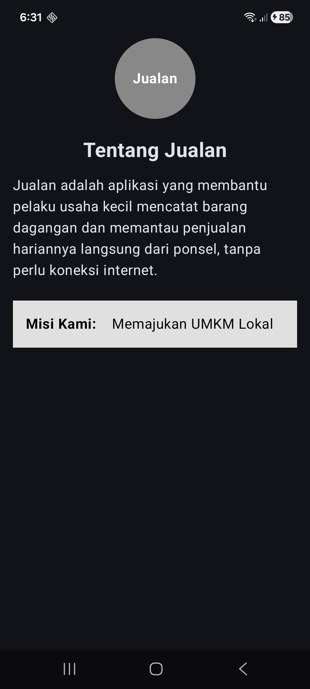

# Identitas

Nama  : Hafizh Naufal Raditya  
NIM   : H1D024061  
Shift : A

# Pertemuan 1 — Membuat Project & Dasar Compose

Aplikasi **Jualan**, dibangun dengan Kotlin dan Jetpack Compose sesuai modul
Pertemuan 1.

- Application name : `Jualan`
- Package name     : `com.pemmob1.h1d024061`
- Min SDK          : 24
- Target SDK       : 37

# Screenshot

## Display Pertemuan 1



Dijalankan di Samsung Galaxy A53 5G (SM-A536E), Android 16.

# Yang Diimplementasikan

Layar utama dibangun lewat satu fungsi `@Composable` bernama
`LayoutTentangJualan()`, berisi:

| Komponen | Penerapan |
|---|---|
| `Column` | `fillMaxSize()`, `padding(16.dp)`, `horizontalAlignment = CenterHorizontally` |
| `Box` | `size(100.dp)`, `clip(CircleShape)`, `background(Color.Gray)`, konten rata tengah |
| `Text` dalam Box | tulisan "Jualan" berwarna putih dan tebal |
| `Spacer` | pemberi jarak antar elemen, `height(24.dp)` dan `height(16.dp)` |
| `Text` | judul "Tentang Jualan" dan paragraf deskripsi aplikasi |
| `Row` | `fillMaxWidth()`, `background(Color(0xFFE0E0E0))`, `padding(16.dp)` |
| `Modifier.weight()` | "Misi Kami:" `weight(1f)` dan "Memajukan UMKM Lokal" `weight(2f)`, sehingga ruang terbagi 1/3 dan 2/3 |

Dua urutan `Modifier` yang ditekankan modul diterapkan persis:

- Pada `Box`, `.clip(CircleShape)` dipanggil **sebelum** `.background()`, sehingga
  warna abu-abu hanya mengisi area yang sudah dipotong bulat.
- Pada `Row`, `.background()` dipanggil **sebelum** `.padding()`, sehingga area
  padding ikut terwarnai.

# Menjalankan

```bash
./gradlew :app:assembleDebug
```

Atau buka folder ini di Android Studio lalu tekan **Run**.

Sejak Pertemuan 2, isi layar dipindahkan ke `ui/screen/`, sehingga `@Preview`
kini dibuat di berkas layar masing-masing, bukan lagi di `MainActivity.kt`.


---

# Pertemuan 2 — Material Design

Melanjutkan aplikasi **Jualan** dari Pertemuan 1. Aplikasi kini punya dua
halaman yang terhubung navigasi, serta sistem desain warna dan tipografi
sendiri.

## Screenshot

### Display Pertemuan 2

_Menyusul — screenshot kedua halaman saat dijalankan di perangkat._

## Yang Diimplementasikan

| Bagian modul | Penerapan |
|---|---|
| A. Modifikasi `Color.kt` | Palet baru: Primary `#3AA34B`, PrimaryVariant `#0F8B88`, Secondary `#76BA43`, Background `#F5F5F5`, Surface `#FFFFFF` |
| B. Modifikasi `Theme.kt` | Warna dipetakan ke peran Material 3 (`primary`, `secondary`, `tertiary`, `background`, `surface`) untuk mode terang dan gelap |
| C. Modifikasi Tipografi | `Type.kt` ditulis ulang: headline, title, body, dan label memakai `FontFamily.SansSerif` dengan `fontWeight`, `fontSize` (sp), `lineHeight`, dan `letterSpacing` |
| D. Membuat Screen Baru | Package `ui.screen`, berkas `HubungiKamiScreen.kt` sebagai Top-Level Function |
| D.5 Dependency | `navigation-runtime-ktx` dan `navigation-compose` versi 2.10.0 lewat version catalog |
| D.7 Menambahkan icon | Empat Vector Asset di `res/drawable`: `back_icon`, `mail_icon`, `send_icon`, `info_icon` |
| D.8–13 | `remember { mutableStateOf("") }`, `Scaffold`, `TopAppBar` dengan tombol kembali, `Column`, dua `OutlinedTextField`, dan `Button` berisi `Row` |
| E. Modifikasi MainActivity | Isi `LayoutTentangJualan` dipindahkan ke `BasicInfoScreen.kt`; teks nama produk diganti ikon aplikasi; `Card` dan `Text` memakai warna serta tipografi dari tema |
| F. Halaman Navigasi | `NavHost` dengan dua rute: `basic_info` (awal) dan `form_screen` |
| G. SnackBar | `SnackbarHostState` + `rememberCoroutineScope`, dipanggil dari `onClick` tombol Kirim Pesan |
| H. Dynamic Color | `dynamicColor` diubah menjadi `false` |

## Catatan tentang Dynamic Color

Ini bagian yang paling mudah terlewat. Selama `dynamicColor` masih bernilai
`true`, seluruh palet hijau di `Color.kt` **diabaikan** pada Android 12 ke atas
— warna aplikasi diambil dari wallpaper ponsel. Setelah diubah menjadi `false`,
desain visualnya terkunci dan tetap seragam di perangkat mana pun.

## Struktur berkas

```
app/src/main/
├── java/com/pemmob1/h1d024061/
│   ├── MainActivity.kt          # tema + NavHost dua rute
│   ├── ui/screen/
│   │   ├── BasicInfoScreen.kt   # halaman informasi aplikasi
│   │   └── HubungiKamiScreen.kt # halaman formulir + Snackbar
│   └── ui/theme/
│       ├── Color.kt             # palet warna
│       ├── Theme.kt             # pemetaan peran warna, dynamicColor = false
│       └── Type.kt              # skala tipografi kustom
└── res/drawable/                # back_icon, mail_icon, send_icon, info_icon
```
