# Identitas

Nama  : Hafizh Naufal Raditya  
NIM   : H1D024061  
Shift : A

# Pertemuan 1 — Membuat Project & Dasar Compose

Aplikasi **Jualan**, dibangun dengan Kotlin dan Jetpack Compose sesuai modul
Pertemuan 1.

- Application name : `Jualan`
- Package name     : `com.pemmob1.h1d024061`
- Min SDK          : 24
- Target SDK       : 37

# Screenshot

## Display Pertemuan 1


Dijalankan di Samsung Galaxy A53 5G (SM-A536E), Android 16.

# Yang Diimplementasikan

Layar utama dibangun lewat satu fungsi `@Composable` bernama
`LayoutTentangJualan()`, berisi:

| Komponen | Penerapan |
|---|---|
| `Column` | `fillMaxSize()`, `padding(16.dp)`, `horizontalAlignment = CenterHorizontally` |
| `Box` | `size(100.dp)`, `clip(CircleShape)`, `background(Color.Gray)`, konten rata tengah |
| `Text` dalam Box | tulisan "Jualan" berwarna putih dan tebal |
| `Spacer` | pemberi jarak antar elemen, `height(24.dp)` dan `height(16.dp)` |
| `Text` | judul "Tentang Jualan" dan paragraf deskripsi aplikasi |
| `Row` | `fillMaxWidth()`, `background(Color(0xFFE0E0E0))`, `padding(16.dp)` |
| `Modifier.weight()` | "Misi Kami:" `weight(1f)` dan "Memajukan UMKM Lokal" `weight(2f)`, sehingga ruang terbagi 1/3 dan 2/3 |

Dua urutan `Modifier` yang ditekankan modul diterapkan persis:

- Pada `Box`, `.clip(CircleShape)` dipanggil **sebelum** `.background()`, sehingga
  warna abu-abu hanya mengisi area yang sudah dipotong bulat.
- Pada `Row`, `.background()` dipanggil **sebelum** `.padding()`, sehingga area
  padding ikut terwarnai.

# Menjalankan

```bash
./gradlew :app:assembleDebug
```

Atau buka folder ini di Android Studio lalu tekan **Run**.

Sejak Pertemuan 2, isi layar dipindahkan ke `ui/screen/`, sehingga `@Preview`
kini dibuat di berkas layar masing-masing, bukan lagi di `MainActivity.kt`.


---

# Pertemuan 2 — Material Design

Melanjutkan aplikasi **Jualan** dari Pertemuan 1. Aplikasi kini punya dua
halaman yang terhubung navigasi, serta sistem desain warna dan tipografi
sendiri.

## Screenshot

### Display Pertemuan 2

Dijalankan di Samsung Galaxy A53 5G (SM-A536E), Android 16.

**1. BasicInfoScreen** — halaman informasi aplikasi

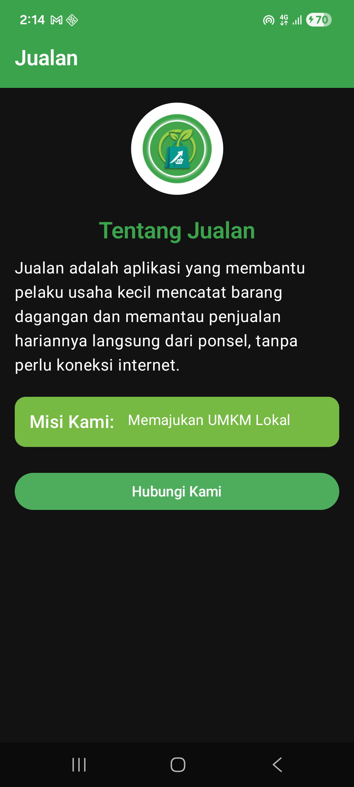

**2. HubungiKamiScreen** — halaman formulir

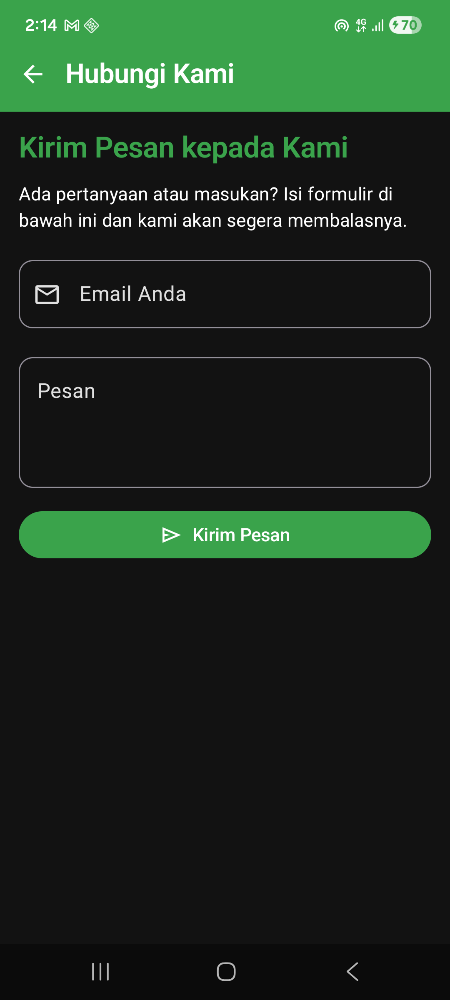

**3. Snackbar** — muncul setelah tombol Kirim Pesan ditekan

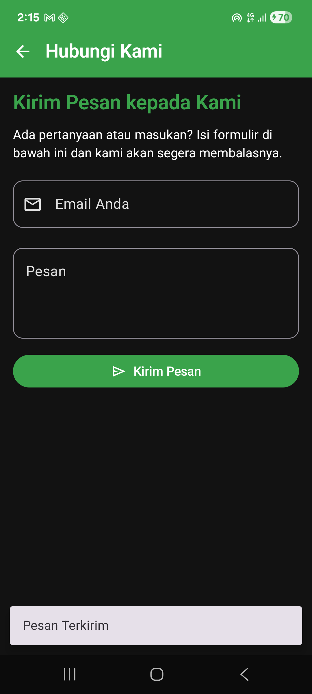

## Yang Diimplementasikan

| Bagian modul | Penerapan |
|---|---|
| A. Modifikasi `Color.kt` | Palet baru: Primary `#3AA34B`, PrimaryVariant `#0F8B88`, Secondary `#76BA43`, Background `#F5F5F5`, Surface `#FFFFFF` |
| B. Modifikasi `Theme.kt` | Warna dipetakan ke peran Material 3 (`primary`, `secondary`, `tertiary`, `background`, `surface`) untuk mode terang dan gelap |
| C. Modifikasi Tipografi | `Type.kt` ditulis ulang: headline, title, body, dan label memakai `FontFamily.SansSerif` dengan `fontWeight`, `fontSize` (sp), `lineHeight`, dan `letterSpacing` |
| D. Membuat Screen Baru | Package `ui.screen`, berkas `HubungiKamiScreen.kt` sebagai Top-Level Function |
| D.5 Dependency | `navigation-runtime-ktx` dan `navigation-compose` versi 2.10.0 lewat version catalog |
| D.7 Menambahkan icon | Empat Vector Asset di `res/drawable`: `back_icon`, `mail_icon`, `send_icon`, `info_icon` |
| D.8–13 | `remember { mutableStateOf("") }`, `Scaffold`, `TopAppBar` dengan tombol kembali, `Column`, dua `OutlinedTextField`, dan `Button` berisi `Row` |
| E. Modifikasi MainActivity | Isi `LayoutTentangJualan` dipindahkan ke `BasicInfoScreen.kt`; teks nama produk diganti ikon aplikasi; `Card` dan `Text` memakai warna serta tipografi dari tema |
| F. Halaman Navigasi | `NavHost` dengan dua rute: `basic_info` (awal) dan `form_screen` |
| G. SnackBar | `SnackbarHostState` + `rememberCoroutineScope`, dipanggil dari `onClick` tombol Kirim Pesan |
| H. Dynamic Color | `dynamicColor` diubah menjadi `false` |

## Catatan tentang Dynamic Color

Ini bagian yang paling mudah terlewat. Selama `dynamicColor` masih bernilai
`true`, seluruh palet hijau di `Color.kt` **diabaikan** pada Android 12 ke atas
— warna aplikasi diambil dari wallpaper ponsel. Setelah diubah menjadi `false`,
desain visualnya terkunci dan tetap seragam di perangkat mana pun.

## Struktur berkas

```
app/src/main/
├── java/com/pemmob1/h1d024061/
│   ├── MainActivity.kt          # tema + NavHost dua rute
│   ├── ui/screen/
│   │   ├── BasicInfoScreen.kt   # halaman informasi aplikasi
│   │   └── HubungiKamiScreen.kt # halaman formulir + Snackbar
│   └── ui/theme/
│       ├── Color.kt             # palet warna
│       ├── Theme.kt             # pemetaan peran warna, dynamicColor = false
│       └── Type.kt              # skala tipografi kustom
└── res/drawable/                # back_icon, mail_icon, send_icon, info_icon
```


---

# Pertemuan 3 — Dynamic Lists with Lazy Layouts

Melanjutkan aplikasi **Jualan**. Layar pembuka kini adalah halaman
**Daftar Produk UMKM**: deretan kategori yang bisa digeser ke samping dan kisi
produk dua kolom yang tersaring sesuai kategori terpilih.

## Screenshot

### Display Pertemuan 3

Dijalankan di Samsung Galaxy A53 5G (SM-A536E), Android 16, mode gelap.

**1. DaftarProdukScreen** — kategori Makanan terpilih saat aplikasi dibuka

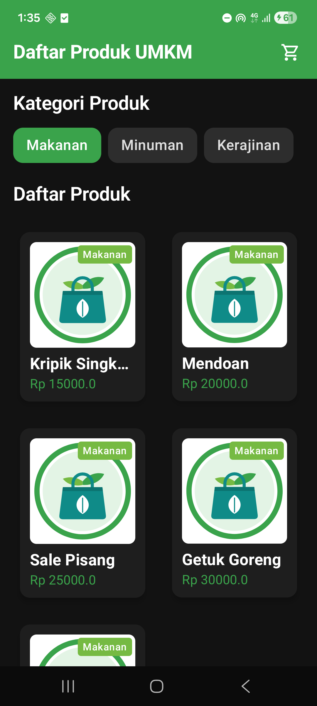

**2. Pindah kategori** — setelah Minuman diketuk, kisi hanya berisi produk minuman

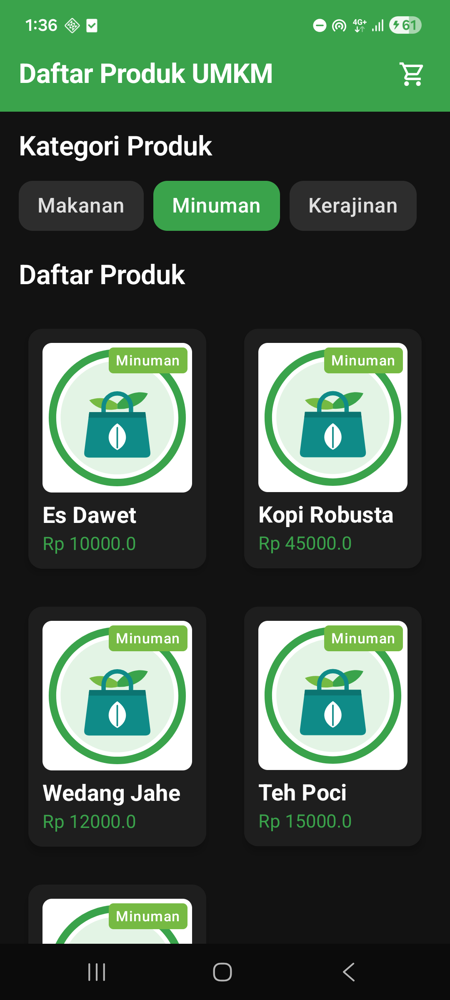

**3. Toast** — muncul setelah kartu Es Dawet diketuk

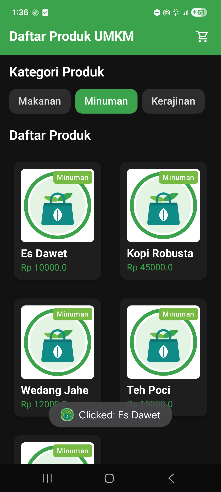

## Rekaman Layar

Aplikasi dibuka pada layar Daftar Produk UMKM, kategori dipilih sehingga kisi
produk ikut tersaring, lalu kartu produk diketuk sampai Toast muncul.
Durasi 22 detik, tanpa suara.

[8-rekaman-aplikasi.mp4](8-rekaman-aplikasi.mp4)

> Klik tautan di atas untuk membuka berkasnya di GitHub. Video diputar di
> halaman berkas tersebut; README sendiri tidak bisa memutar video.

## Yang Diimplementasikan

| Bagian modul | Penerapan |
|---|---|
| A. Package baru | `data.model` dan `data.dummy` |
| B. Data class `Category` | `id: Int`, `name: String`, `description: String?`, `products_count: Int?` |
| C. Data class `Product` | `id`, `category_id`, `category: Category?`, `name`, `description: String?`, `price: Double`, `stock`, `img` |
| D. Data dummy | `object DummyData` (Singleton) berisi 3 kategori dan 15 produk khas Banyumas–Purbalingga, dibuat dengan `listOf()` |
| E. `ProductItemCard` | `Card` dengan elevasi 4dp → `Column` → `Box` berisi `Image` rasio 1:1 dan label kategori di pojok kanan atas → nama produk (maks. 1 baris) dan harga |
| E.3 Gambar produk | `dummy_product.xml`, Vector Drawable buatan sendiri (tas belanja dan daun, palet hijau aplikasi) |
| F. `CategoryItem` | `Card` yang berganti warna: `primary` saat dipilih, `surfaceVariant` saat tidak |
| G. `@Preview` | `PreviewProduct`, dan `PreviewCategory` dengan tombol kategori tepat di tengah layar |
| H.1 State dan filter | `remember { mutableStateOf(...firstOrNull()?.id) }` untuk kategori terpilih, `filter { }` untuk menyaring produk |
| H.1 TopAppBar | "Daftar Produk UMKM" tebal di atas latar `primary`, ikon keranjang `cart_icon` (Material Symbols) di kanan |
| H.3 Kategori | `LazyRow` dengan `contentPadding` 16dp dan jarak antaritem 8dp |
| H.4 Daftar produk | `LazyVerticalGrid` dua kolom (`GridCells.Fixed(2)`), jarak 16dp; ketuk kartu → `Toast` "Clicked: <nama produk>" |
| H.5 Preview terang dan gelap | Dua anotasi `@Preview` pada `PreviewDaftarProduk`, yang kedua memakai `uiMode = UI_MODE_NIGHT_YES` |
| I. `HomeActivity` | Activity baru sebagai Launcher Activity; `intent-filter` MAIN/LAUNCHER dipindahkan dari `MainActivity` |
| J. Modifikasi `HomeActivity` | `onCreate` hanya memanggil `JualanTheme { DaftarProdukScreen() }`; fungsi bawaan templat dihapus |

## Catatan

- **Halaman Pertemuan 1–2 tidak lagi terbuka dari ikon aplikasi.** Sesuai
  modul bagian I.4, `MainActivity` tidak lagi menjadi Launcher Activity.
  Kodenya tetap ada dan tidak diubah.
- **Label `HomeActivity` sengaja tidak ditulis di manifest.** Nama di bawah
  ikon aplikasi diambil dari label Launcher Activity. Tanpa label sendiri,
  Android memakai label aplikasi, sehingga tetap tertulis "Jualan", bukan
  "HomeActivity".
- **`key = { it.id }` ditambahkan** pada `items()` di `LazyRow` dan
  `LazyVerticalGrid`. Dengan key, Compose mengenali setiap item lewat id-nya,
  sehingga daftar tidak salah menggambar item saat isinya berganti karena
  kategori dipilih.

## Struktur berkas

```
app/src/main/
├── AndroidManifest.xml              # HomeActivity sebagai launcher
├── java/com/pemmob1/h1d024061/
│   ├── HomeActivity.kt              # layar pembuka baru
│   ├── MainActivity.kt              # halaman Pertemuan 1–2 (tidak diubah)
│   ├── data/
│   │   ├── model/
│   │   │   ├── Category.kt          # data class kategori
│   │   │   └── Product.kt           # data class produk
│   │   └── dummy/
│   │       └── DummyData.kt         # object berisi data tiruan
│   └── ui/screen/
│       └── DaftarProductScreen.kt   # ProductItemCard, CategoryItem,
│                                    # DaftarProdukScreen, dan @Preview
└── res/drawable/
    ├── cart_icon.xml                # ikon keranjang di TopAppBar
    └── dummy_product.xml            # gambar produk 1:1
```

# Pertemuan 4 — Recomposition dan UI Lifecycle

Melanjutkan aplikasi **Jualan**. Halaman daftar produk kini punya kolom
pencarian dengan indikator memuat, kartu produk membuka **halaman detail**, dan
formulir Hubungi Kami dilengkapi dropdown, unggah gambar, kotak centang, serta
validasi. Seluruh layar dipecah menjadi pasangan **stateful** dan **stateless**
sesuai pola State Hoisting.

## Screenshot

### Display Pertemuan 4

Dijalankan di Samsung Galaxy A53 5G (SM-A536E), Android 16, mode gelap.

**1. Daftar produk** — kolom pencarian, ikon keranjang, dan menu tiga titik

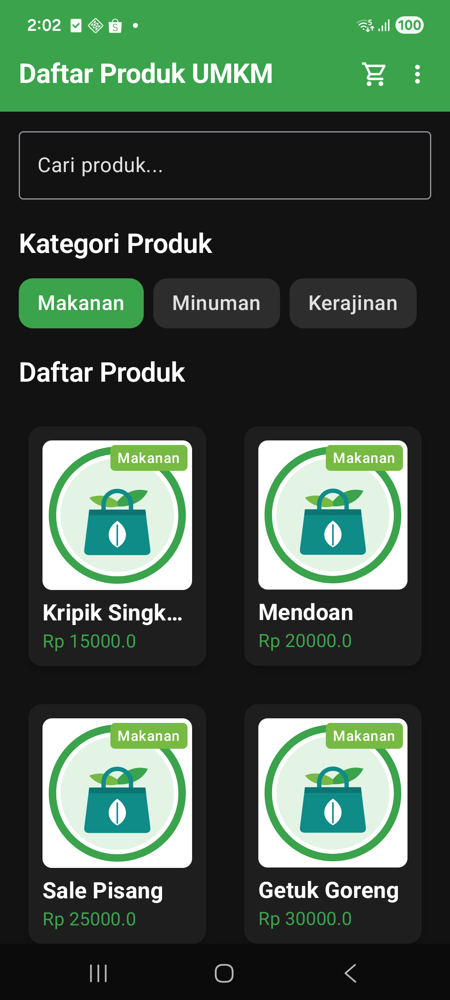

**2. Indikator memuat** — muncul selama `delay(1000)` di dalam `LaunchedEffect`,
setiap kali kategori diganti atau kata kunci diketik

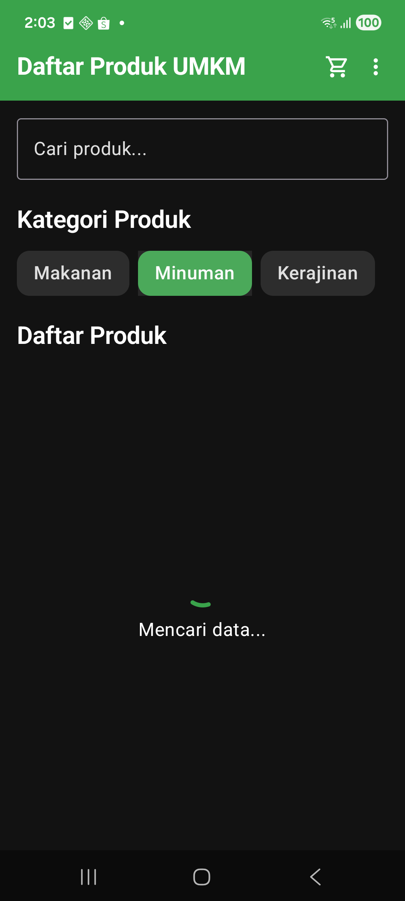

**3. Pencarian** — mengetik "kripik" menyaring kisi produk

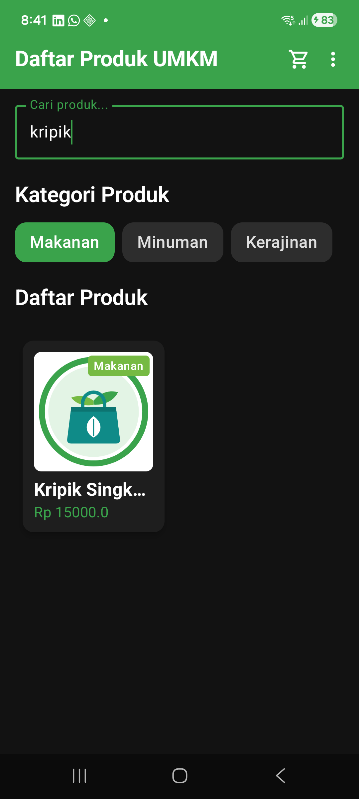

**4. Hasil kosong** — kata kunci "nasi goreng" tidak cocok dengan produk mana pun

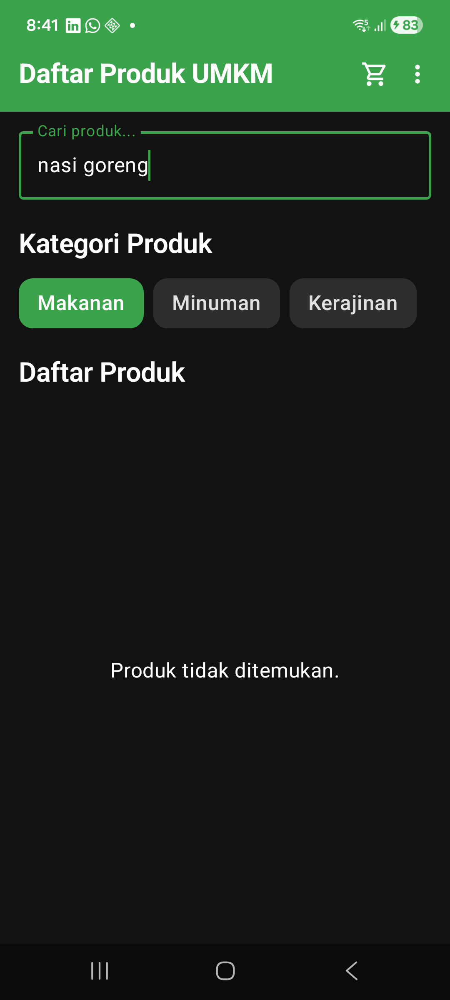

**5. Menu Action** — menu tiga titik berisi pintasan ke Hubungi Kami

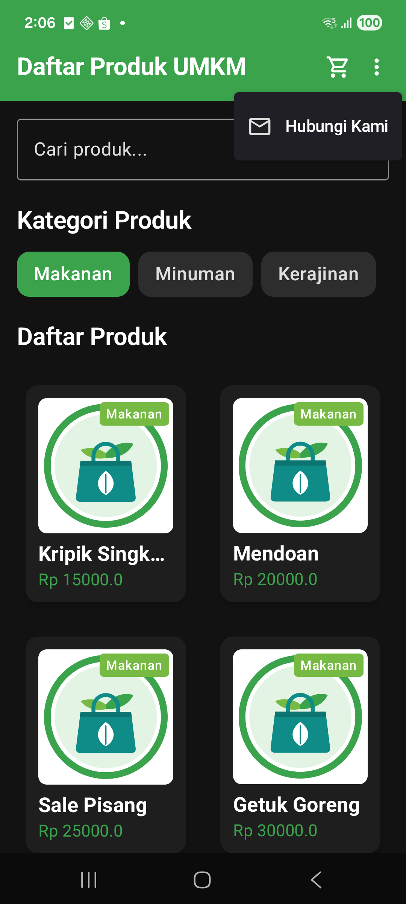

**6. Detail produk** — dibuka dari kartu produk, lengkap dengan pengatur jumlah
beli dan Toast setelah tombol keranjang ditekan

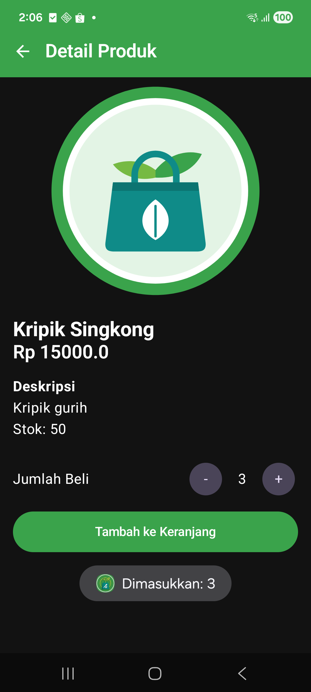

**7. Formulir Hubungi Kami** — tombol Kirim mati karena formulir belum sah

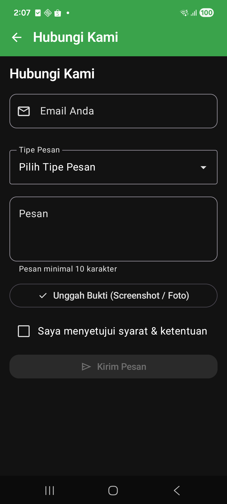

**8. Dropdown Tipe Pesan** — tiga pilihan dari `ExposedDropdownMenuBox`

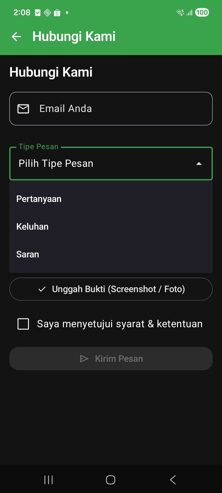

**9. Validasi email** — teks tanpa "@" langsung ditandai merah

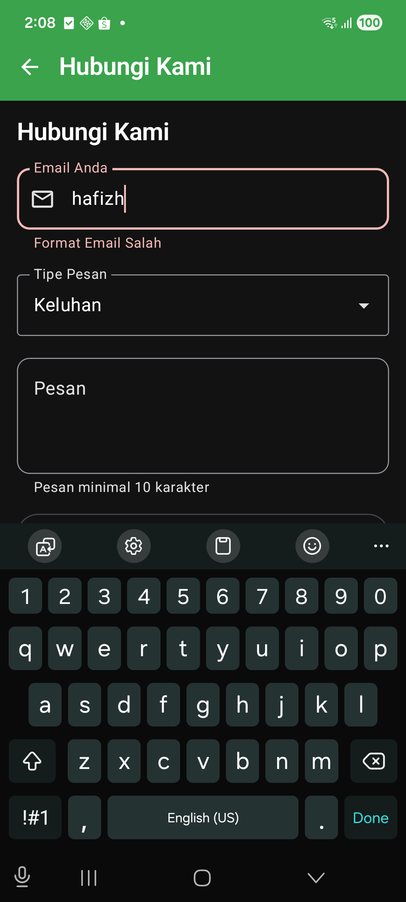

**10. Pesan terkirim** — setelah semua syarat terpenuhi, tombol menyala dan
Snackbar muncul

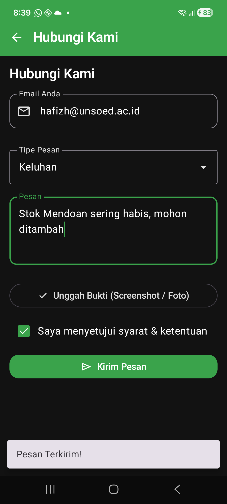

## Yang Diimplementasikan

| Bagian modul | Penerapan |
|---|---|
| A. Permissions | `READ_MEDIA_IMAGES` dan `READ_EXTERNAL_STORAGE` (`maxSdkVersion="32"`) dideklarasikan di atas tag `<application>` |
| B.1 Deklarasi variabel | `emailText` dan `messageText` dengan `remember`; `problemType` dan `isAgreed` dengan `rememberSaveable`; `imageUri` bertipe `Uri?` |
| B.2 Validasi | `isEmailValid` (`contains("@")` + `isNotBlank()`), `isMessageValid` (`length >= 10`), `isFormValid` (gabungan seluruh syarat) |
| B.3 State Hoisting | `StatelessFormHubungiKami` menerima nilai (`email`) dan lambda (`onEmailChange`); tidak menyimpan data sendiri |
| B.4 PhotoPicker | `rememberLauncherForActivityResult` + `ActivityResultContracts.PickVisualMedia()`, dibuka dengan `PickVisualMediaRequest(ImageOnly)` |
| B.8 Validasi di UI | `isError` dan `supportingText` pada `OutlinedTextField` |
| B.9 Dropdown | `ExposedDropdownMenuBox` + `ExposedDropdownMenu`, kolom `readOnly = true`, `menuAnchor(MenuAnchorType.PrimaryNotEditable)` |
| B.10 Bukti dan persetujuan | `Card` hanya dirender saat `imageUri != null`, menampilkan `imageUri.lastPathSegment`; `Checkbox` stateless |
| B.11 Tombol kirim | `enabled = isFormValid`, `onClick = onSubmit` |
| C.1 Parameter navigasi | `DaftarProdukScreen(navController: NavController? = null)` |
| C.2 Asinkron | `LaunchedEffect(selectedCategoryId, searchQuery)` dengan `delay(1000)`, menyaring kategori lalu kata kunci (`ignoreCase = true`) |
| C.3 Stateless | `StatelessDaftarProduct` menerima `categories`, `products`, `isLoading`, dan empat lambda |
| C.5 Pencarian | `OutlinedTextField` dengan `singleLine = true` di atas daftar kategori |
| C.7 Tiga kondisi | `CircularProgressIndicator` + "Mencari data..." saat memuat, "Produk tidak ditemukan." saat kosong, `LazyVerticalGrid` saat ada isi |
| D. Detail produk | `DetailProductScreen` (stateful, memuat produk lewat `find`) dan `StatelessDetailProduct` (Scaffold, gambar, deskripsi, pengatur jumlah, tombol keranjang) |
| E. Navigasi | `NavHost` di `HomeActivity` dengan rute `daftar_produk`, `detail/{productId}` (`NavType.IntType`), dan `hubungi_kami` |
| F. Menu Action | `IconButton` tiga titik + `DropdownMenu` berisi "Hubungi Kami" |

## Catatan

- **Ikon disimpan sendiri di `res/drawable`.** Proyek ini tidak memakai pustaka
  `material-icons`, jadi `Icons.Default.MoreVert` dan `Icons.Default.Email` pada
  modul diganti dengan `more_vert_icon.xml` dan `mail_icon.xml` yang diimpor
  lewat **Vector Asset**, mengikuti cara yang dipakai sejak Pertemuan 2.
- **`menuAnchor()` tanpa argumen sudah usang** pada versi Material 3 yang
  dipakai proyek ini, sehingga ditulis
  `menuAnchor(MenuAnchorType.PrimaryNotEditable)`.
- **Izin penyimpanan tetap dideklarasikan** sesuai bagian A modul, meskipun
  `PickVisualMedia` sebenarnya tidak memerlukannya. Pemilih foto sistem
  menyerahkan satu gambar terpilih tanpa memberi aplikasi akses ke seluruh
  galeri.
- Semua fitur di atas sudah diuji langsung di perangkat, termasuk pemilih foto
  sistem yang terbuka saat tombol Unggah Bukti ditekan.

## Struktur berkas

```
app/src/main/
├── AndroidManifest.xml               # + uses-permission untuk galeri
├── java/com/pemmob1/h1d024061/
│   ├── HomeActivity.kt               # NavHost: daftar_produk, detail/{productId}, hubungi_kami
│   └── ui/screen/
│       ├── DaftarProductScreen.kt    # DaftarProdukScreen + StatelessDaftarProduct
│       ├── DetailProductScreen.kt    # DetailProductScreen + StatelessDetailProduct
│       └── HubungiKamiScreen.kt      # HubungiKamiScreen + StatelessFormHubungiKami
└── res/drawable/
    ├── icon_check.xml                # centang pada kartu berkas terpilih
    └── more_vert_icon.xml            # ikon tiga titik di AppBar
```
